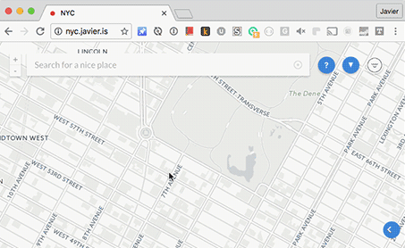

I'll be spending September in NYC. Here are some of the places I'd like to visit.  

If you have any cool suggestion, you can add them [here](nyc.javier.is)

[Ping me](http://twitter.com/javier) if you want to hang out.

# :circus_tent: Events

#### THE SKETCHBOOK PROJECT

Friday, September 9 at 6:30 PM - 8:30 PM

> Brooklyn Art Library  
> 28 Frost St.  
> Brooklyn, New York 11211

https://www.facebook.com/events/1100120236725498/

#### THE NY ART BOOK FAIR

September 16-18, 2016  
Preview: Thursday, September 15, 6-9pm

> MoMA PS1  
> 22-25 Jackson Avenue on 46th Avenue  
> Long Island City, NY  

http://nyartbookfair.com/conference/

---

# :round_pushpin: Places

## Museums & Galleries

### New Museum

> New Museum  
> 235 Bowery  
> New York, NY 10002 

http://www.newmuseum.org

### Swiss Institute

> Swiss Institute / CONTEMPORARY ART  
> Swiss In situ  
> 102 Franklin Street  
> New York, NY 10013

**Gallery Opening Hours**  
Wednesday to Sunday, 12 – 6 PM

http://www.swissinstitute.net

### NYU Game Center

> 2 Metrotech Center 8th Floor   
> Brooklyn, NY 11201

http://gamecenter.nyu.edu

### MoMa PS1

> MoMA PS1  
> 22-25 Jackson Avenue on 46th Avenue  
> Long Island City, NY

http://momaps1.org

### Seagram

> 375 Park Ave 10152  
> New York, NY  

http://www.archdaily.com/59412/seagram-building-mies-van-der-rohe/

- [The Met](http://www.metmuseum.org)
- The Guggenheim  
- MoMa  
- Whitney Museum 
- [American Museum of Natural History](http://www.amnh.org)
- [Public Art Fund](https://www.publicartfund.org)  
- [International Center of Photography](http://www.icp.org/museum)
- Openhouse Gallery
- Cooper Hewitt
- [Leica gallery](http://us.leica-camera.com/culture/galleries/gallery_new_york)
- [Brooklyn Museum](http://www.brooklynmuseum.org)
- [Dia Beacon](http://www.diacenter.org/sites/main/beacon)
- Chelsea galleries 

---

## :herb: Parks

- Highline Park
- New York Botanical Garden
- [Nowadays.nyc](http://nowadays.nyc)

## :coffee: Cofee

- La Colombe
- [Russ & Daughters Cafe](http://www.russanddaughterscafe.com)

---

## :books: Bookshops

- Strand Bookstore
- McNally Jackson Books
- Spoonbill & Sugartown
- Mast Books
- St. Mark's bookshop http://www.stmarksbookshop.com

---

## :pizza: Food

- Miss Lily's & Melvin's Juice Box
- Ippudo
- Minca
- Momofuku

---

## :gem: Shops

### Printed Matter 
 
> 231 11th Avenue  
> New York, NY 10001

https://www.printedmatter.org

---

## Other

### SFPC

> 155 Bank St.  
> New York, NY 10014

http://sfpc.io

---

To add:

- http://www.untitledatthewhitney.com
- Grand Central Terminal
- Cocoron Soba
- Sakagura
- Lady M
- Basta Pasta
- Van Leeuwen
- Chelsea Market
- Fika
- Vitsœ
- Forbidden Planet
- IFC Center
- Miss Lily's & Melvin's Juice Box
- 826NYC & The Brooklyn Superhero Supply Co.
- Ippudo
- Minca
- http://www.pearlpaint.com
- B&H http://www.bhphotovideo.com

### Resources

- [For New York](https://bondstreet.com/fornewyork/posts)
- [Pizzas](https://munchies.vice.com/en/videos/the-pizza-show-brooklyn)
